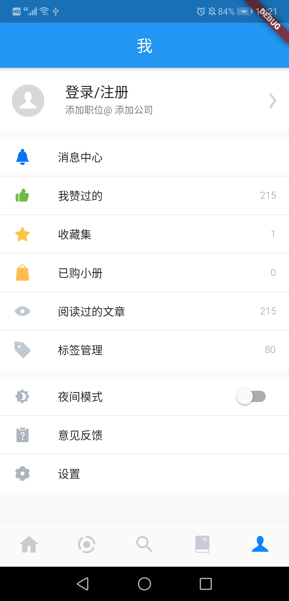

# JueJin App

Imitate Juejin only for study(only a few page has finished)

## Some Screenshots

## use plugins
- flutter_webview_plugin
- dio
- flutter_swiper
- cached_network_image
- ~~flutter_screenutil~~
- url_launcher
- provider: ^3.0.0+1
- timeago: ^2.0.18
- fluttertoast: ^3.1.0
- flutter_localizations
